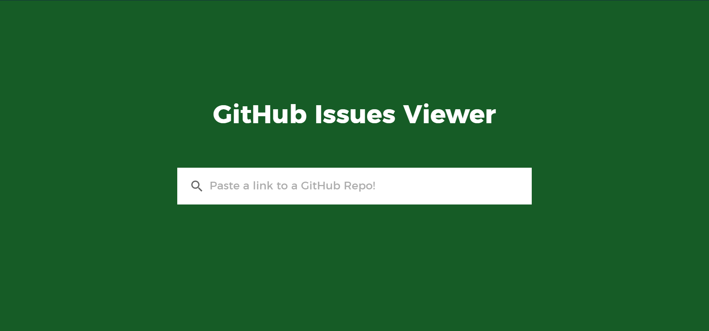
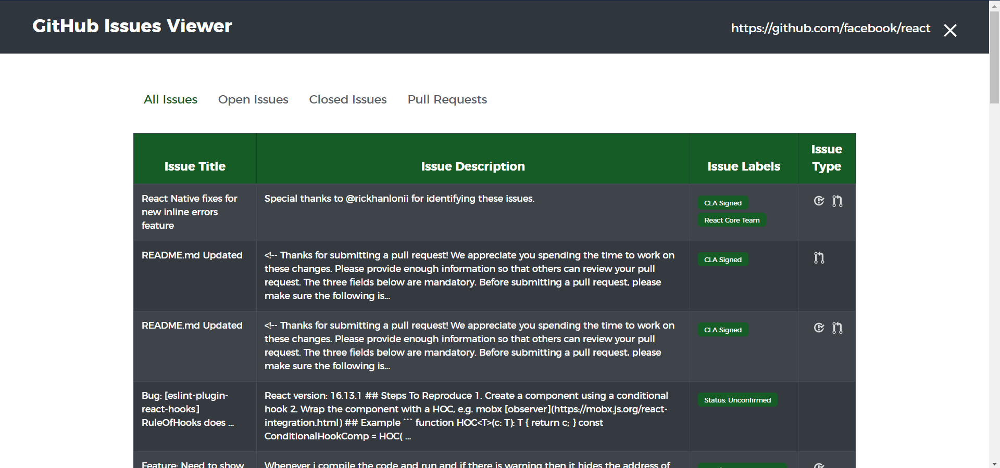

# GitHub Issues Viewer

 

## :star: Introduction 
A simple web app that utilizes the [GitHub API](https://docs.github.com/en/free-pro-team@latest/rest) to fetch and display a list of issues from any GitHub repository.

Features include:
- Fetching issue data from a GitHub repository URL (with error handling)
- Displaying a list of issues and their details in a table format
- Filtering the issues by: “Open”, “Closed” and “Pull Request” categories
- Allowing users to visit the original issue by clicking the issue title in the table
- A responsive design that looks good across all devices

## :sparkles: Live Version
You can view a [live version of the web-app here](https://scheng20.github.io/github-issues-viewer/). 

## :computer: Steps to Run Locally
- Clone the repository
- Install the required dependencies by running `npm install`
- Start the web server by calling `npm start`
- Go to `http://localhost:3000/` in your browser
- Interact with the webapp by entering a GitHub repository URL and filtering the results

## :bulb: Origins
Originally the creation of this web-app was tasked to me as an interview assignment for a company I applied to. After completing the initial requirements, I decided to take this project further and put my own spin on things and add some additional design / features that were not required in the original outline. With permission from the company, I’m able to showcase this new re-vamped version of the web-app.
